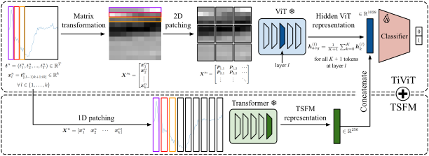

# TiViT Extension

基于 TiViT 的时间序列分类实验扩展。本仓库将 UCR/UEA 时间序列样本转换为图像，再使用冻结的预训练 Vision Transformer 提取表示，并在这些表示上训练轻量分类器。项目也支持将 TiViT 表示与 Mantis、MOMENT 等时间序列基础模型表示拼接，用于分类、表示对齐和表示结构分析。

当前实现支持两种时间序列图像化方式：

- `line_plot`：默认方式，将每个通道绘制为 224x224 折线图。
- `segment`：将时间序列切成二维灰度片段后送入 ViT。

## 项目结构

```text
.
├── main.py                         # 实验入口
├── requirements.txt                # Python 依赖
├── assets/methodology.svg          # TiViT 方法示意图
├── src/
│   ├── arguments.py                # 命令行参数
│   ├── datautils.py                # UCR/UEA 数据加载与预处理
│   ├── tivit.py                    # 时间序列到图像转换与 ViT 表示提取
│   ├── embedding.py                # TiViT/Mantis/MOMENT 表示抽取与拼接
│   ├── classifier.py               # 线性分类与传统分类器
│   ├── analysis.py                 # intrinsic dimension、PCA、alignment 分析
│   ├── mutual_knn.py               # mutual k-NN 对齐指标
│   └── utils.py                    # 随机种子、切分、结果写入等工具
└── scripts/
    ├── run_lineplot_ucr.sh         # UCR 折线图模式示例
    ├── run_lineplot_uea.sh         # UEA 折线图模式示例
    ├── check_ts_file.py            # 检查 .ts 数据格式
    └── repair_ts_labels.py         # 修复标签分隔符异常的 .ts 文件
```

## 方法概览



TiViT 的核心流程是：

1. 从 UCR 或 UEA benchmark 加载时间序列数据。
2. 对时间序列做必要的缺失值插值、补齐和标准化。
3. 将每个时间序列通道转换为图像。
4. 使用冻结的 ViT、CLIP、DINOv2、SigLIP 2 或 MAE 模型抽取隐藏层表示。
5. 对隐藏表示做 `mean` 或 `cls_token` 聚合。
6. 使用 `logistic_regression`、`nearest_centroid` 或 `random_forest` 分类器评估分类准确率。

多通道时间序列会逐通道提取表示，并在特征维度上拼接。

## 环境安装

建议使用 Python 3.11。依赖中包含来自 GitHub 的 `mantis-tsfm` 和 `momentfm`，首次安装通常需要联网。

```bash
conda create -n tivit_env python=3.11
conda activate tivit_env
python -m pip install -r requirements.txt
```

主要依赖包括：

- `torch==2.7.1`
- `torchvision==0.22.1`
- `aeon==1.2.0`
- `open_clip_torch==2.32.0`
- `transformers==4.53.0`
- `scikit-learn==1.6.1`
- `dadapy==0.3.3`

## 数据准备

项目通过 `aeon.datasets.load_classification` 读取 UCR/UEA 数据。代码会在 `--data_dir` 下按 benchmark 名称组织数据：

```text
<data_dir>/
├── UCR/
└── UEA/
```

运行时用 `--datasets ucr` 或 `--datasets uea` 指定 benchmark。可以用 `--dataset_names` 限制只跑部分数据集。

默认情况下，UCR 数据会经过以下处理：

- 变长序列补齐到同一长度。
- 缺失值线性插值。
- 使用训练集均值和标准差做标准化。

如果希望使用 aeon 自带的预处理方式，可以添加 `--aeon`。

## 模型准备

`--vit_1_name` 和 `--vit_2_name` 可以传入 Hugging Face 模型 ID 或本地模型目录。当前代码支持：

- OpenCLIP LAION CLIP：`laion/CLIP-ViT-B-32-laion2B-s34B-b79K`、`laion/CLIP-ViT-B-16-laion2B-s34B-b88K`、`laion/CLIP-ViT-L-14-laion2B-s32B-b82K`、`laion/CLIP-ViT-H-14-laion2B-s32B-b79K`
- DINOv2：`facebook/dinov2-small`、`facebook/dinov2-base`、`facebook/dinov2-large`
- SigLIP 2：`google/siglip2-so400m-patch14-224`
- MAE：`facebook/vit-mae-base`、`facebook/vit-mae-large`、`facebook/vit-mae-huge`

如果使用本地 OpenCLIP 模型目录，目录中需要包含 `.safetensors`、`.bin`、`.pt` 或 `.pth` 权重文件。脚本示例默认开启离线模式：

```bash
export HF_HUB_OFFLINE=1
export TRANSFORMERS_OFFLINE=1
```

## 快速运行

下面示例使用 CLIP ViT-H 第 14 层、折线图输入和逻辑回归分类器，在 UCR 的 `ECG200` 与 `FordA` 上运行：

```bash
python main.py \
  --vit_1_name laion/CLIP-ViT-H-14-laion2B-s32B-b79K \
  --vit_1_layer 14 \
  --aggregation mean \
  --patch_size sqrt \
  --stride 0.1 \
  --classifier_type logistic_regression \
  --datasets ucr \
  --dataset_names ECG200 FordA \
  --data_dir /path/to/dataset \
  --result_dir /path/to/results \
  --random_seed 2021 \
  --val_ratio 0.2 \
  --image_mode line_plot
```

UEA 示例：

```bash
python main.py \
  --vit_1_name laion/CLIP-ViT-H-14-laion2B-s32B-b79K \
  --vit_1_layer 14 \
  --aggregation mean \
  --patch_size sqrt \
  --stride 0.1 \
  --classifier_type logistic_regression \
  --datasets uea \
  --dataset_names BasicMotions SelfRegulationSCP1 \
  --data_dir /path/to/dataset \
  --result_dir /path/to/results \
  --random_seed 2021 \
  --val_ratio 0.2 \
  --image_mode line_plot
```

仓库中也提供了两个 bash 脚本：

```bash
bash scripts/run_lineplot_ucr.sh
bash scripts/run_lineplot_uea.sh
```

可通过环境变量覆盖脚本中的路径和数据集：

```bash
PROJECT_DIR=/path/to/TiViT_Extension \
MODEL_DIR=/path/to/CLIP-ViT-H-14-laion2B-s32B-b79K \
DATA_DIR=/path/to/dataset \
RESULT_DIR=/path/to/results \
DATASETS="ECG200 FordA" \
bash scripts/run_lineplot_ucr.sh
```

## 使用 segment 图像模式

`segment` 模式会将一维序列切成二维灰度图。此时 `--patch_size` 和 `--stride` 会参与切分：

```bash
python main.py \
  --vit_1_name laion/CLIP-ViT-H-14-laion2B-s32B-b79K \
  --vit_1_layer 14 \
  --aggregation mean \
  --patch_size sqrt \
  --stride 0.1 \
  --classifier_type logistic_regression \
  --datasets ucr \
  --dataset_names ECG200 \
  --data_dir /path/to/dataset \
  --result_dir /path/to/results \
  --random_seed 2021 \
  --val_ratio 0.2 \
  --image_mode segment
```

`--patch_size` 支持：

- `sqrt`：使用 `sqrt(T)` 作为 patch size。
- `linspace`：在多个 patch size 上循环实验。

`line_plot` 模式不会使用 patch size，内部会将 patch size 置为 `None`。

## 融合 Mantis 或 MOMENT

添加 `--mantis` 可拼接 Mantis 表示：

```bash
python main.py \
  --vit_1_name laion/CLIP-ViT-H-14-laion2B-s32B-b79K \
  --vit_1_layer 14 \
  --aggregation mean \
  --patch_size sqrt \
  --stride 0.1 \
  --classifier_type logistic_regression \
  --datasets ucr \
  --dataset_names ECG200 \
  --data_dir /path/to/dataset \
  --result_dir /path/to/results \
  --random_seed 2021 \
  --val_ratio 0.2 \
  --image_mode line_plot \
  --mantis
```

添加 `--moment small`、`--moment base` 或 `--moment large` 可拼接 MOMENT 表示。

## 表示分析

计算 intrinsic dimension：

```bash
python main.py \
  --vit_1_name laion/CLIP-ViT-H-14-laion2B-s32B-b79K \
  --aggregation mean \
  --patch_size sqrt \
  --stride 0.1 \
  --get_intrinsic_dimension \
  --datasets ucr \
  --dataset_names ECG200 \
  --data_dir /path/to/dataset \
  --result_dir /path/to/results \
  --random_seed 2021 \
  --val_ratio 0.2
```

计算覆盖 95% 方差所需的主成分数量：

```bash
python main.py \
  --vit_1_name laion/CLIP-ViT-H-14-laion2B-s32B-b79K \
  --aggregation mean \
  --patch_size sqrt \
  --stride 0.1 \
  --get_principal_components \
  --datasets ucr \
  --dataset_names ECG200 \
  --data_dir /path/to/dataset \
  --result_dir /path/to/results \
  --random_seed 2021 \
  --val_ratio 0.2
```

测量两个模型表示空间的 mutual k-NN 对齐分数：

```bash
python main.py \
  --vit_1_name laion/CLIP-ViT-H-14-laion2B-s32B-b79K \
  --vit_1_layer 14 \
  --aggregation mean \
  --patch_size sqrt \
  --stride 0.1 \
  --mantis \
  --measure_alignment \
  --datasets ucr \
  --dataset_names ECG200 \
  --data_dir /path/to/dataset \
  --result_dir /path/to/results \
  --random_seed 2021 \
  --val_ratio 0.2
```

对齐分析一次只能包含两个模型表示。

## 常用参数

| 参数 | 说明 |
| --- | --- |
| `--vit_1_name` / `--vit_2_name` | 第一个/第二个视觉骨干模型的 Hugging Face ID 或本地路径 |
| `--vit_1_layer` / `--vit_2_layer` | 抽取表示的 ViT 层数；不指定时可用于逐层分析 |
| `--aggregation` | 隐藏表示聚合方式，当前支持 `mean`、`cls_token` |
| `--image_mode` | 时间序列图像化方式，支持 `line_plot`、`segment`，默认 `line_plot` |
| `--patch_size` | `segment` 模式下的 patch size 策略，支持 `sqrt`、`linspace` |
| `--stride` | `segment` 模式下的滑窗步长，表示为 patch size 的比例 |
| `--classifier_type` | 分类器类型，支持 `logistic_regression`、`nearest_centroid`、`random_forest` |
| `--datasets` | benchmark 类型，支持 `ucr`、`uea` |
| `--dataset_names` | 可选，指定只运行哪些数据集 |
| `--batch_size` | dataloader batch size，默认 `128` |
| `--data_dir` | 数据目录，必填 |
| `--result_dir` | 结果输出目录，必填 |
| `--random_seed` | 随机种子 |
| `--val_ratio` | 从官方训练集划分验证集的比例，默认 `0.2` |
| `--mantis` | 启用 Mantis 表示 |
| `--moment` | 启用 MOMENT 表示，取值 `small`、`base`、`large` |
| `--measure_alignment` | 计算两个模型表示的 mutual k-NN 对齐分数 |
| `--get_intrinsic_dimension` | 计算表示的 intrinsic dimension |
| `--get_principal_components` | 计算覆盖 95% 方差所需主成分数量 |

## 输出结果

每次运行会在 `--result_dir` 下创建一个带时间戳的子目录：

```text
<result_dir>/<timestamp>_<datasets>_<models>_<classifier_type>/
```

常见输出文件：

- `args.json`：本次运行的参数。
- `train_val.csv`：分类实验结果，包含数据集名、图像模式、patch size、验证准确率和测试准确率。
- `splits/<dataset>_seed<seed>_val<ratio>.npz`：从官方训练集划分出的 train/val 索引。
- `alignment_score.csv`：表示对齐分数。
- `intrinsic_dimensionality.csv`：逐层 intrinsic dimension。
- `principal_components.csv`：逐层 PCA 主成分数量。

## 数据格式辅助脚本

检查 `.ts` 文件格式：

```bash
python scripts/check_ts_file.py /path/to/file.ts
```

修复部分 `.ts` 文件中“标签被逗号分隔而不是冒号分隔”的问题：

```bash
python scripts/repair_ts_labels.py /path/to/file.ts
```

默认会输出 `<input>.fixed.ts`。如需原地替换并生成备份：

```bash
python scripts/repair_ts_labels.py /path/to/file.ts --in-place
```

## 注意事项

- `main.py` 会自动选择 `cuda` 或 `cpu`，大模型建议使用 GPU。
- 首次使用在线 Hugging Face 模型时，需要联网下载权重。
- 使用离线模型时，确保模型路径和权重文件完整。
- `--classifier_type`、`--measure_alignment`、`--get_intrinsic_dimension`、`--get_principal_components` 代表不同任务类型，一次运行通常选择其中一种。
- `--random_seed` 建议显式指定，否则部分依赖随机种子的逻辑可能不可复现。

## 上游论文与引用

本项目基于 TiViT：

```bibtex
@article{roschmann2025tivit,
  title={Time Series Representations for Classification Lie Hidden in Pretrained Vision Transformers},
  author={Simon Roschmann and Quentin Bouniot and Vasilii Feofanov and Ievgen Redko and Zeynep Akata},
  journal={arXiv preprint arXiv:2506.08641},
  year={2025}
}
```

相关资源：

- TiViT 论文：https://arxiv.org/abs/2506.08641
- UCR/UEA benchmark：https://www.timeseriesclassification.com/
- aeon：https://www.aeon-toolkit.org/
