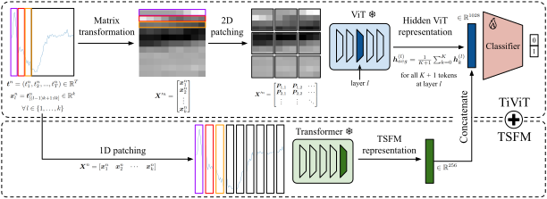

# TiViT Extension

This repository implements multimodal time-series classification with Activity Graph visual inputs, CLIP-ViT visual features, optional time-series foundation-model features, and several fusion strategies.

The main entry point is `main.py`; reusable logic lives in `src/`.

## Overview

Activity Graph converts one multichannel time-series sample:

```text
x in R^(C x T)
```

into an image-like representation that can be consumed by ViT / CLIP-ViT. The current reproducible experiment path combines:

- visual branch: Activity Graph -> CLIP-ViT-H/14
- time-series branch: Mantis-8M
- classifier: PyTorch MLP head
- fusion modes: `concat`, `concat_attn`, `cross_attn_gate`, `masked_pretrain`

## Method Figure



## Repository Layout

```text
TiViT_Extension/
|-- main.py                         # Experiment entry point
|-- run_experiments.sh              # Main batch experiment script
|-- run_small_data_experiments.sh   # Smaller three-seed reproducibility script
|-- run_all_fusions.sh              # Simple fusion sweep script
|-- requirements.txt                # Full Python dependencies
|-- requirements_runtime.txt        # Runtime-only dependency list
|-- scripts/
|   |-- check_ts_file.py            # Inspect custom time-series CSV files
|   |-- repair_ts_labels.py         # Repair custom CSV label formatting
|   `-- test_custom_datasets.py     # Smoke-test custom dataset loaders
`-- src/
    |-- arguments.py                # CLI arguments
    |-- datautils.py                # UCR / UEA / UCI / Feng / FallTL loaders
    |-- tivit.py                    # TiViT, Activity Graph, image preprocessing
    |-- mlp_classifier.py           # MLP classifier and fusion modules
    |-- classifier.py               # Traditional classifier path
    |-- embedding.py                # Embedding extraction
    |-- analysis.py                 # Representation analysis
    |-- mutual_knn.py               # Mutual-kNN alignment
    `-- utils.py                    # Seeds, splits, result writing, sample export
```

## Installation

Python 3.11 is recommended.

```bash
conda create -n tivit_env python=3.11
conda activate tivit_env
python -m pip install -r requirements.txt
```

The experiments assume local model checkpoints. Pass local checkpoint paths with:

- `--vit_1_name`
- `--mantis_name`
- optional `--vit_2_name`

For batch scripts, the same local paths can be configured without editing the files:

```bash
export MODEL_DIR=/path/to/CLIP-ViT-H-14-laion2B-s32B-b79K
export MANTIS_DIR=/path/to/Mantis-8M
export DATA_DIR=/path/to/dataset
export RESULT_DIR=/path/to/results
export PYTHON_BIN="$(which python3)"
```

If these variables are not set, the scripts use the local defaults encoded near the top of each `.sh` file.

## Data Inputs

`main.py` selects the data loader with `--datasets`.

| Option | Dataset source | Loader behavior |
| --- | --- | --- |
| `ucr` | UCR archive | load through `aeon`, then re-split |
| `uea` | UEA archive | load through `aeon`, then re-split |
| `uci` | UCI HAR | load local train/test files, then re-split |
| `feng` | Feng CSV files | sliding windows from `P*.csv` files |
| `falltl` | FallTL CSV files | sliding windows from FallTL CSV files |

Model batches use:

```text
(B, C, T)
B = batch size
C = channels
T = time length
```

For custom CSV datasets, windows are built from contiguous label segments:

```text
--window_size 200
--window_stride 100
--custom_test_ratio 0.2
--max_windows_per_file 20
```

Feng uses `Activity` as the label column and prefers accelerometer/gyroscope columns from `LowerBack`, `RightThigh`, and `LeftThigh`. FallTL uses:

```text
AccX, AccY, AccZ, GyrX, GyrY, GyrZ, EulerX, EulerY, EulerZ
```

## Model Flow

For `--image_mode activity_graph`:

```text
time series batch (B, C, T)
  -> Activity Graph rendering
  -> image tensor (B, 3, 224, 224)
  -> CLIP-ViT feature
```

With `--mantis`, the same time-series batch also goes through Mantis-8M. The branch embeddings are fused and passed to an MLP classifier.

Supported fusion modes:

| Fusion mode | Description |
| --- | --- |
| `concat` | concatenate branch embeddings directly |
| `concat_attn` | attention-based interaction after concatenation |
| `cross_attn_gate` | cross-attention with a learned gate; current query branch is `ts` |
| `masked_pretrain` | fusion pretraining with masked branch reconstruction before classification |

## Reproducible Workflows

There are two maintained batch scripts.

| Script | Purpose | Seeds | Datasets |
| --- | --- | --- | --- |
| `run_experiments.sh` | Main batch run with the larger MLP/fusion configuration | `2021` | UEA: `BasicMotions`, `SelfRegulationSCP1`; UCR: `ECG200`, `FordA`; Feng; FallTL |
| `run_small_data_experiments.sh` | Smaller, faster three-seed run for repeatability checks | `2021`, `2022`, `2023` | UEA: `BasicMotions`; UCR: `ECG200`; Feng |

Both scripts run the four fusion modes in the same order:

```text
concat -> concat_attn -> cross_attn_gate -> masked_pretrain
```

Both scripts skip completed runs by scanning existing `args.json` and `train_val.csv` files under `--result_dir`. To reproduce a clean run, point `RESULT_DIR` at an empty directory.

### Main Batch Run

`run_experiments.sh` is the primary experiment script. It uses:

| Parameter | Value |
| --- | --- |
| `--image_mode` | `activity_graph` |
| `--vit_1_layer` | `14` |
| `--aggregation` | `mean` |
| `--mantis` | enabled |
| `--classifier_type` | `mlp` |
| `--fusion_dim` | `512` |
| `--fusion_heads` | `4` |
| `--cross_attn_query` | `ts` |
| `--mask_prob` | `0.3` |
| `--pretrain_epochs` | `5` |
| `--mlp_hidden_dim` | `512` |
| `--mlp_num_layers` | `2` |
| `--mlp_dropout` | `0.1` |
| `--mlp_lr` | `1e-4` |
| `--mlp_weight_decay` | `1e-4` |
| `--mlp_epochs` | `20` |
| `--mlp_early_stop_patience` | `3` |
| `--batch_size` | `32` |
| `--val_ratio` | `0.25` |
| `--random_seed` | `2021` |

Run:

```bash
export MODEL_DIR=/path/to/CLIP-ViT-H-14-laion2B-s32B-b79K
export MANTIS_DIR=/path/to/Mantis-8M
export DATA_DIR=/path/to/dataset
export RESULT_DIR=/path/to/tivit_results
export PYTHON_BIN="$(which python3)"

./run_experiments.sh 2>&1 | tee run_experiments.log
```

The script processes datasets in this order:

```text
UEA -> UCR -> Feng -> FallTL
```

### Small-Data Three-Seed Run

`run_small_data_experiments.sh` is the recommended lightweight reproducibility script. It keeps the same multimodal model path but reduces model dimensions and dataset size so repeated runs are easier to complete.

| Parameter | Value |
| --- | --- |
| `--image_mode` | `activity_graph` |
| `--vit_1_layer` | `14` |
| `--aggregation` | `mean` |
| `--mantis` | enabled |
| `--classifier_type` | `mlp` |
| `--fusion_dim` | `128` |
| `--fusion_heads` | `2` |
| `--cross_attn_query` | `ts` |
| `--mask_prob` | `0.2` |
| `--pretrain_epochs` | `3` |
| `--mlp_hidden_dim` | `128` |
| `--mlp_num_layers` | `1` |
| `--mlp_dropout` | `0.3` |
| `--mlp_lr` | `3e-4` |
| `--mlp_weight_decay` | `1e-3` |
| `--mlp_epochs` | `40` |
| `--mlp_early_stop_patience` | `8` |
| `--batch_size` | `16` |
| `--val_ratio` | `0.25` |
| `--random_seed` | `2021`, `2022`, `2023` |

Run:

```bash
export MODEL_DIR=/path/to/CLIP-ViT-H-14-laion2B-s32B-b79K
export MANTIS_DIR=/path/to/Mantis-8M
export DATA_DIR=/path/to/dataset
export RESULT_DIR=/path/to/tivit_small_results
export PYTHON_BIN="$(which python3)"

./run_small_data_experiments.sh 2>&1 | tee run_small_data.log
```

This script runs:

```text
BasicMotions x 4 fusion modes x 3 seeds
ECG200       x 4 fusion modes x 3 seeds
Feng         x 4 fusion modes x 3 seeds
```

For Feng, it uses `--window_size 200`, `--window_stride 100`, `--custom_test_ratio 0.2`, and `--max_windows_per_file 20`.

## Single-Run Examples

UEA example:

```bash
python3 main.py \
  --vit_1_name /path/to/CLIP-ViT-H-14-laion2B-s32B-b79K \
  --vit_1_layer 14 \
  --aggregation mean \
  --image_mode activity_graph \
  --mantis \
  --mantis_name /path/to/Mantis-8M \
  --classifier_type mlp \
  --modal_interaction cross_attn_gate \
  --fusion_dim 512 \
  --fusion_heads 4 \
  --cross_attn_query ts \
  --mlp_hidden_dim 512 \
  --mlp_num_layers 2 \
  --mlp_dropout 0.1 \
  --mlp_lr 1e-4 \
  --mlp_weight_decay 1e-4 \
  --mlp_epochs 20 \
  --mlp_early_stop_patience 3 \
  --batch_size 32 \
  --datasets uea \
  --dataset_names BasicMotions SelfRegulationSCP1 \
  --data_dir /path/to/dataset \
  --result_dir /path/to/results \
  --random_seed 2021 \
  --val_ratio 0.25
```

Custom CSV example:

```bash
python3 main.py \
  --vit_1_name /path/to/CLIP-ViT-H-14-laion2B-s32B-b79K \
  --vit_1_layer 14 \
  --aggregation mean \
  --image_mode activity_graph \
  --mantis \
  --mantis_name /path/to/Mantis-8M \
  --classifier_type mlp \
  --modal_interaction concat_attn \
  --window_size 200 \
  --window_stride 100 \
  --custom_test_ratio 0.2 \
  --max_windows_per_file 20 \
  --batch_size 16 \
  --datasets feng \
  --data_dir /path/to/dataset \
  --result_dir /path/to/results \
  --random_seed 2021 \
  --val_ratio 0.25
```

## Ablation Workflow

The ablation runner evaluates five unique conditions. Shared conditions are
reused across the three reported comparisons so the same baseline is not run
twice.

| Condition | Vision branch | Time-series branch | Interaction |
| --- | --- | --- | --- |
| `vision_line_plot` | multichannel RGB line plot | disabled | single branch |
| `vision_activity_graph` | Activity Graph | disabled | single branch |
| `timeseries_mantis` | disabled | Mantis-8M | single branch |
| `multimodal_concat` | Activity Graph | Mantis-8M | direct concatenation |
| `multimodal_proposed` | Activity Graph | Mantis-8M | `cross_attn_gate` by default |

The three comparisons are:

1. Activity Graph: `vision_line_plot` vs. `vision_activity_graph`.
2. Multimodal feature extraction: `timeseries_mantis` vs.
   `vision_activity_graph` vs. `multimodal_concat`.
3. Multimodal fusion: `multimodal_concat` vs. `multimodal_proposed`.

`multichannel_line_plot` overlays all raw channels as fixed-color curves on one
white 224 x 224 RGB canvas. Unlike the legacy `line_plot` mode, it does not send
each channel through the vision backbone separately.

The synchronized defaults are stored in `scripts/ablation_config.sh`:

| Parameter | Default |
| --- | --- |
| datasets | Feng, FallTL, UCIHAR |
| seeds | 2022, overridable with `SEEDS` |
| repeats per seed | 3 |
| vision backbone | CLIP ViT-H/14, layer 14, mean aggregation |
| time-series backbone | Mantis-8M |
| proposed fusion | `cross_attn_gate`, query=`ts` |
| fusion dimension / heads | 512 / 4 |
| MLP | 2 layers, hidden 512, dropout 0.1 |
| optimizer | AdamW, lr `1e-4`, weight decay `1e-4` |
| training | 20 epochs, early-stop patience 3, batch size 32 |
| split | custom test 0.2, validation 0.25 of remaining training data |
| custom windows | length 200, stride 100 |
| Feng cap | 20 windows per CSV |
| FallTL cap | 2 windows per CSV |

Run on another server after overriding machine-specific paths and selecting up
to five available GPUs:

```bash
cd /path/to/Tivit_Extension-main

SERVER_ROOT=/path/to/Tivit_extension \
DATA_DIR=/path/to/data \
MODEL_DIR=/path/to/CLIP-ViT-H-14-laion2B-s32B-b79K \
MANTIS_DIR=/path/to/Mantis-8M \
PYTHON_BIN=/path/to/tivit_env/bin/python \
GPUS="0 1 2 3 4" \
SEEDS="2022" \
REPEATS=3 \
bash scripts/run_ablation_tmux.sh
```

The launcher creates one tmux window per GPU plus one summary window. Results
are written below `results/ablation_<timestamp>/`, and the final aggregate is
`ablation_summary.csv`. To measure variation across independent random splits,
override with `SEEDS="2021 2022 2023" REPEATS=1`.

## Training and Evaluation

For all datasets, any existing train/test partitions are combined and split again
with `--custom_test_ratio`; stratification is used when class counts allow it.

Inside the training split, validation indices are sampled with:

```text
--val_ratio 0.25
```

For every dataset, `--custom_test_ratio 0.2` followed by `--val_ratio 0.25`
produces an overall train/validation/test ratio of 60/20/20, subject to integer
rounding for small datasets.

The MLP path uses:

- optimizer: AdamW
- loss: cross-entropy
- early stopping: validation macro-F1 patience
- final evaluation: best validation checkpoint when early stopping is enabled

For `masked_pretrain`, the fusion module is first trained with masked reconstruction for `--pretrain_epochs`, then trained for classification.

## Outputs

Each run creates a timestamped folder under `--result_dir`.

| File | Content |
| --- | --- |
| `args.json` | exact CLI arguments |
| `train_val.csv` | validation and test metrics |
| `splits/*.npz` | train/validation split indices |
| `activity_graph_samples/*.png` | optional saved Activity Graph samples |
| `activity_lineplot_samples/*.png` | optional saved line-plot samples |

`train_val.csv` records:

- accuracy
- macro precision
- macro recall
- macro F1
- macro AUROC
- macro AUPRC

## Useful Notes

- At least one feature branch must be enabled: a ViT checkpoint, `--mantis`, or `--moment`.
- `activity_graph` and `activity_matrix` consume the full multichannel sample.
- `segment` mode requires `--patch_size` and `--stride`.
- Sample image export is only for inspection and does not affect training.
- Result folders use timestamps and are not overwritten.
- Local logs, downloaded archives, and result folders are ignored by git.

## Syntax Check

```bash
python3 -m py_compile \
  main.py \
  src/arguments.py \
  src/classifier.py \
  src/datautils.py \
  src/mlp_classifier.py \
  src/utils.py \
  src/tivit.py \
  src/embedding.py
```
